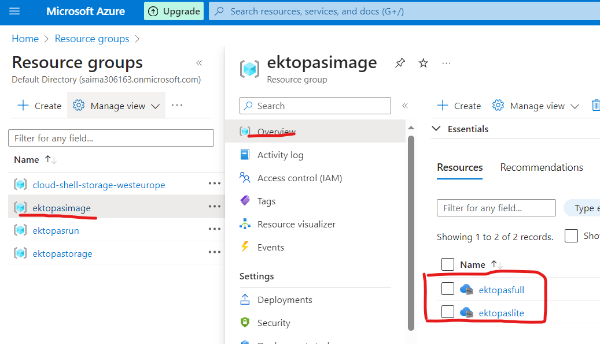

# Azure Container Image Management

## Introduction

- Container images are stored in **Azure Registry**.
- Azure Registry in this project locates at the resource group of **ektopasimage**
- Container images created by Docker can be **pushed** to Azure Registry

---

## Create the Azure Registries: ektopasfull and ektopaslite

1. from **Azure Portal** search `container registries`
   

2. Click 'Create'
   

3. Select/ type in the information as the pictures

    

   | item           | value                              |
   | -------------- | ---------------------------------- |
   | Resource group | ektopasimage                       |
   | Registry name  | ektopasfull or ektopaslite         |
   | Location       | UK South or the one closest to you |
   | Pricing plan   | Standard                           |

   4. newly created registries should be found in the resource group in a few minutes
      

---

## Push the images to Azure registries

1. From Windows powershell or bash, log in the Azure account, this command will lead you to a web authorization page.

   ```bash
   az login
   ```

2. Login to your registry

   ```bash
   #use ektopasfull as example
   az acr login --name ektopasfull
   ```

3. Tag the image you want to push

   ```bash
   #use ektopasfull as example
   docker tag <local-image-name> ektopasfull.azurecr.io/ektopasfull:latest
   ```

4. Push the image to Azure Registry
   ```bash
   docker push ektopasfull.azurecr.io/ektopasfull:latest
   ```

   Image can be found from Azure Portal if pushed successfully


